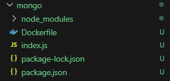

# Conclusión

BIEN! Ahora ambos contenedores están en la misma red y se pueden comunicar entre si.

Pusimos una aplicación en un contenedor.
La conectamos con otros contenedores (base de datos).

Los pasos para cada contenedor son:
- Descargar la imagen de node.
- Crear una red
- Crear un contenedor de mongo en la red.
  - Asignar puertos.
  - Nombres
  - Variables de entorno.
  - Red
  - Indicar imagen (Imagen:TAG)

