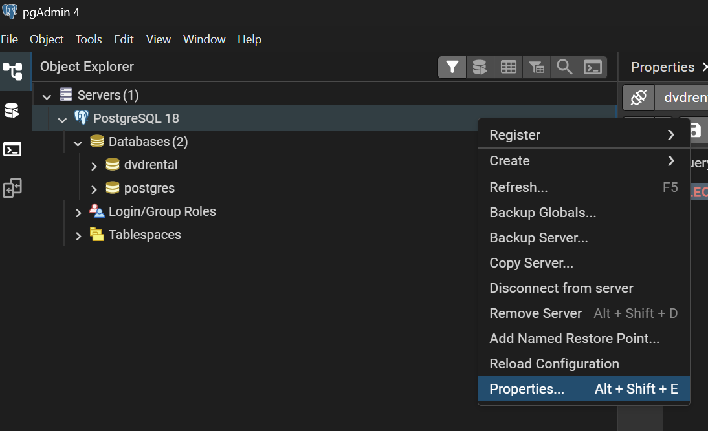
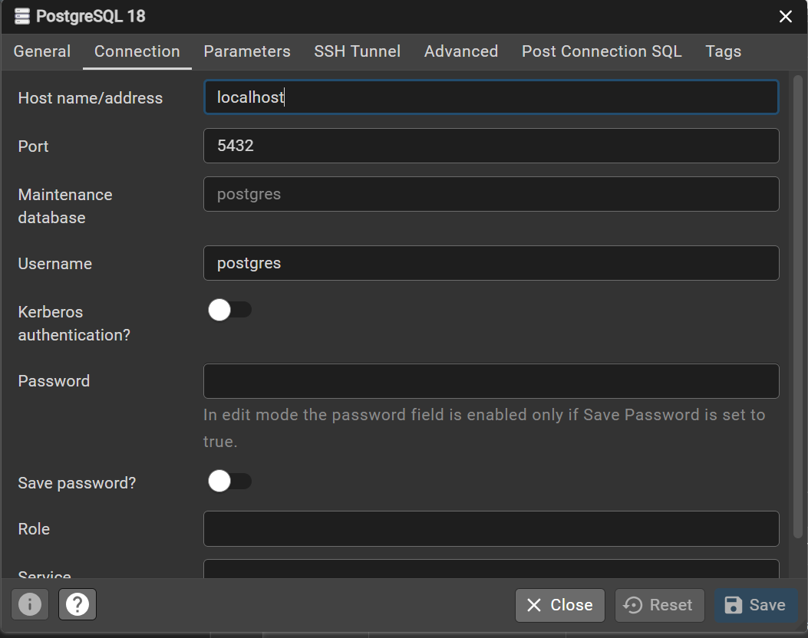
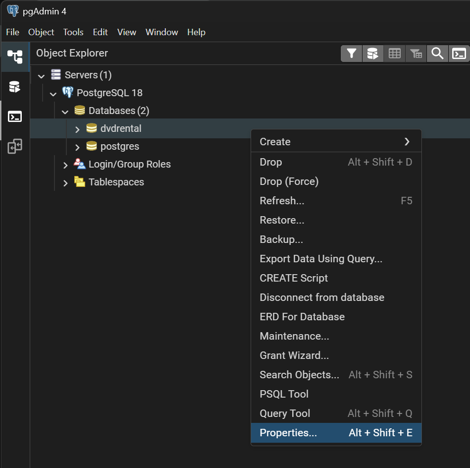
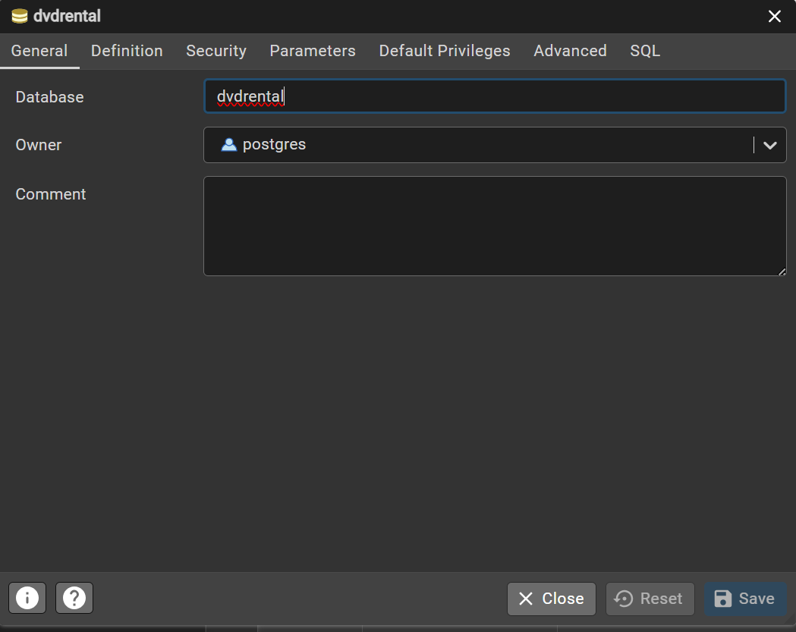
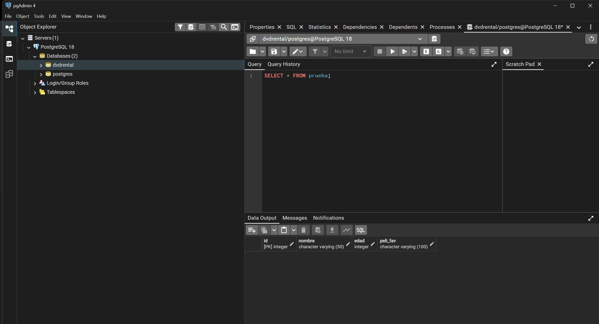
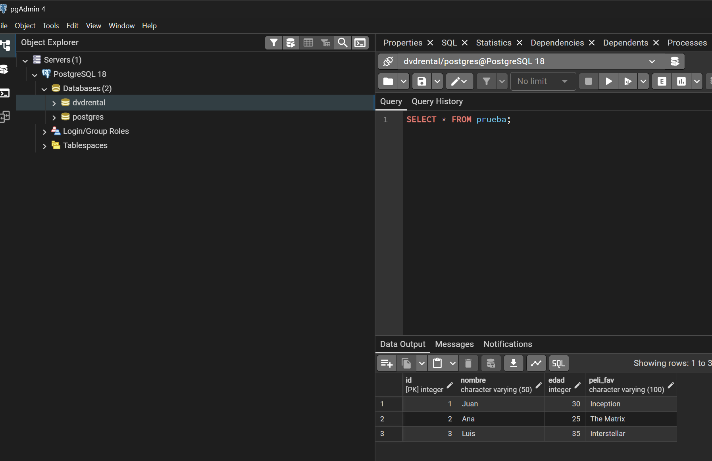

# Datos de conexión





# Instalación de psycopg2
```bash
PS C:\Users\herie> pip3 install psycopg2
Collecting psycopg2
  Downloading psycopg2-2.9.11-cp310-cp310-win_amd64.whl.metadata (5.1 kB)
Downloading psycopg2-2.9.11-cp310-cp310-win_amd64.whl (2.7 MB)
   ━━━━━━━━━━━━━━━━━━━━━━━━━━━━━━━━━━━━━━━━ 2.7/2.7 MB 19.6 MB/s  0:00:00
Installing collected packages: psycopg2
Successfully installed psycopg2-2.9.11
PS C:\Users\herie>
```

# Conexión a PostgreSQL con psycopg2
```python
# Conn es un objeto de conexión a la base de datos
try:
    conn = psycopg2.connect(
        host=hostname,
        dbname=database,
        user=username,
        password=pwd,
        port=port_id
    )
    print("Conexión exitosa")

    conn.close()
    print("Conexión cerrada")
except Exception as e:
    print(f"Ocurrió un error: {e}")
```

# Creating a cursor to modify data

To modify we need to create a cursor and close the connection in the try block. A cursor allows us to execute SQL commands.

```python
# Conn es un objeto de conexión a la base de datos
try:
    conn = psycopg2.connect(
        host=hostname,
        dbname=database,
        user=username,
        password=pwd,
        port=port_id
    )
    print("Conexión exitosa")

    cur = conn.cursor()
    print("Cursor creado")

    # Necesitamos cerrar el cursor y la conexión, es importante porque si no lo hacemos podemos tener fugas de memoria
    cur.close()
    print("Cursor cerrado")
    conn.close()
    print("Conexión cerrada")
except Exception as e:
    print(f"Ocurrió un error: {e}")
```

# Mejor manejo de cierre de conexión y cursor
Es mejor cerrar la conexión dentro del bloque try para asegurarnos de que se cierre correctamente si la conexión se establece con éxito.

```python
conn = None # Aseguramos que conn esté definido
cur = None # Aseguramos que cursor esté definido 

# Conn es un objeto de conexión a la base de datos
try:
    conn = psycopg2.connect(
        host=hostname,
        dbname=database,
        user=username,
        password=pwd,
        port=port_id
    )
    print("Conexión exitosa")
    cur = conn.cursor()
    print("Cursor creado")

except Exception as e:
    print(f"Ocurrió un error: {e}")

# Cerramos el cursor y la conexión en el bloque finally, lo pasamos a un finally para asegurarnos que se ejecute siempre
finally:
    if cur is not None:
        cur.close()
        print("Cursor cerrado")
    if conn is not None:
        conn.close()
        print("Conexión cerrada")
```

# Crear una tabla en PostgreSQL
Ahora que tenemos la conexión y el cursor, podemos crear una tabla en la base de datos.
```python
conn = None # Aseguramos que conn esté definido
cur = None # Aseguramos que cursor esté definido 

# Conn es un objeto de conexión a la base de datos
try:
    conn = psycopg2.connect(
        host=hostname,
        dbname=database,
        user=username,
        password=pwd,
        port=port_id
    )
    print("Conexión exitosa")

    cur = conn.cursor()
    print("Cursor creado")

    # Crear una tabla
    create_table = """
    CREATE TABLE IF NOT EXISTS prueba (
        id SERIAL PRIMARY KEY,
        nombre VARCHAR(50),
        edad INT,
        peli_fav VARCHAR(100)
    );
    """
    # Ejecutar la consulta
    cur.execute(create_table)
    print("Tabla creada")
    # Confirmar los cambios
    conn.commit()
    print("Cambios confirmados")

except Exception as e:
    print(f"Ocurrió un error: {e}")

# Cerramos el cursor y la conexión en el bloque finally, lo pasamos a un finally para asegurarnos que se ejecute siempre
finally:
    if cur is not None:
        cursor.close()
        print("Cursor cerrado")
    if conn is not None:
        conn.close()
        print("Conexión cerrada")
```

Se creo la tabla!


# Agregar datos a la tabla
```python
conn = None # Aseguramos que conn esté definido
cur = None # Aseguramos que cursor esté definido

# Conn es un objeto de conexión a la base de datos
try:
    conn = psycopg2.connect(
        host=hostname,
        dbname=database,
        user=username,
        password=pwd,
        port=port_id
    )
    print("Conexión exitosa")

    cur = conn.cursor()
    print("Cursor creado")

    # Crear una tabla
    create_table = """
    CREATE TABLE IF NOT EXISTS prueba (
        id SERIAL PRIMARY KEY,
        nombre VARCHAR(50),
        edad INT,
        peli_fav VARCHAR(100)
    );
    """
    # Ejecutar la consulta
    cur.execute(create_table)
    print("Tabla creada")
    # Confirmar los cambios
    conn.commit()
    print("Cambios confirmados")

    insert_script = """
    INSERT INTO prueba (nombre, edad, peli_fav) VALUES (%s, %s, %s);
    """
    # %s son placeholders para los valores que vamos a insertar

    # Datos a insertar
    data = [
        ('Juan', 30, 'Inception'),
        ('Ana', 25, 'The Matrix'),
        ('Luis', 35, 'Interstellar')
    ]

    # Se insertan los cambios con executemany para insertar multiples filas
    cur.executemany(insert_script, data)
    print("Datos insertados")
    conn.commit()
    print("Cambios confirmados")

except Exception as e:
    print(f"Ocurrió un error: {e}")

# Cerramos el cursor y la conexión en el bloque finally, lo pasamos a un finally para asegurarnos que se ejecute siempre
finally:
    if cur is not None:
        cur.close()
        print("Cursor cerrado")
    if conn is not None:
        conn.close()
        print("Conexión cerrada")
```

Bienn!!! ya tenemos datos en la tabla!


# Podemos dropper la tabla si queremos
```python
cur.execute("DROP TABLE IF EXISTS prueba;")
conn.commit()
```

# Fetching data from PostgreSQL

```python
cur.execute("SELECT * FROM prueba;")
rows = cur.fetchall()
for row in rows:
    print(row)
```

```
(1, 'Juan', 30, 'Inception')
(2, 'Ana', 25, 'The Matrix')
(3, 'Luis', 35, 'Interstellar')
```

yupi! lo podemos tratar como tupla

```
cur.execute("SELECT * FROM prueba;")
rows = cur.fetchall()
for row in rows:
    print(f"A {row[1]} le gusta {row[3]}")
```

```
A Juan le gusta Inception
A Ana le gusta The Matrix
A Luis le gusta Interstellar
```

# Tratarlo como diccionario

```python
import psycopg2.extras
```

```python
cur = conn.cursor(cursor_factory=psycopg2.extras.DictCursor)
```

```python
cur.execute("SELECT * FROM prueba;")
rows = cur.fetchall()
for row in rows:
    print(f"A {row['nombre']} le gusta {row['peli_fav']}")
```

# Update data in PostgreSQL

Fue el cumple de Juan y ahora tiene 31 años y su película favorita es Inception 2 JJAJA
```python
update_script = """
UPDATE prueba SET edad = %s, peli_fav = %s WHERE nombre = %s;
"""
data = (31, 'Inception 2', 'Juan')
cur.execute(update_script, data)
conn.commit()
print("Datos actualizados")
```

# Delete data in PostgreSQL
Juan ya no es nuestro amigo, lo eliminamos
```python
delete_script = """
DELETE FROM prueba WHERE nombre = %s;
"""
data = ('Juan',)
cur.execute(delete_script, data)
conn.commit()
print("Datos eliminados")
```

# Context managers

Un context manager nos permite manejar recursos como conexiones y cursores de manera más eficiente, asegurando que se cierren automáticamente al finalizar su uso. No necesitamos el bloque finally ni los commits explícitos, siempre y cuando no necesitemos hacer rollback en caso de error.

```python
conn = None # Aseguramos que conn esté definido
cur = None # Aseguramos que cursor esté definido

# Conn es un objeto de conexión a la base de datos
try:
    # Identamos todo uno nivel más adentro
    with psycopg2.connect(
            host=hostname,
            dbname=database,
            user=username,
            password=pwd,
            port=port_id
        ) as conn:
        print("Conexión exitosa")

        with conn.cursor() as cur:
            print("Cursor creado")

        # Crear una tabla
        create_table = """
        CREATE TABLE IF NOT EXISTS prueba (
            id SERIAL PRIMARY KEY,
            nombre VARCHAR(50),
            edad INT,
            peli_fav VARCHAR(100)
        );
        """
        # Ejecutar la consulta
        cur.execute(create_table)
        print("Tabla creada")
        # Confirmar los cambios
        conn.commit()
        print("Cambios confirmados")

        insert_script = """
        INSERT INTO prueba (nombre, edad, peli_fav) VALUES (%s, %s, %s);
        """
        # %s son placeholders para los valores que vamos a insertar

        # Datos a insertar
        data = [
            ('Juan', 30, 'Inception'),
            ('Ana', 25, 'The Matrix'),
            ('Luis', 35, 'Interstellar')
        ]

        # Se insertan los cambios con executemany para insertar multiples filas
        cur.executemany(insert_script, data)
        print("Datos insertados")
        conn.commit()
        print("Cambios confirmados")

except Exception as e:
    print(f"Ocurrió un error: {e}")

# Cerramos el cursor y la conexión en el bloque finally, lo pasamos a un finally para asegurarnos que se ejecute siempre
finally:
    if cur is not None:
        cur.close()
        print("Cursor cerrado")
    if conn is not None:
        conn.close()
        print("Conexión cerrada")
```