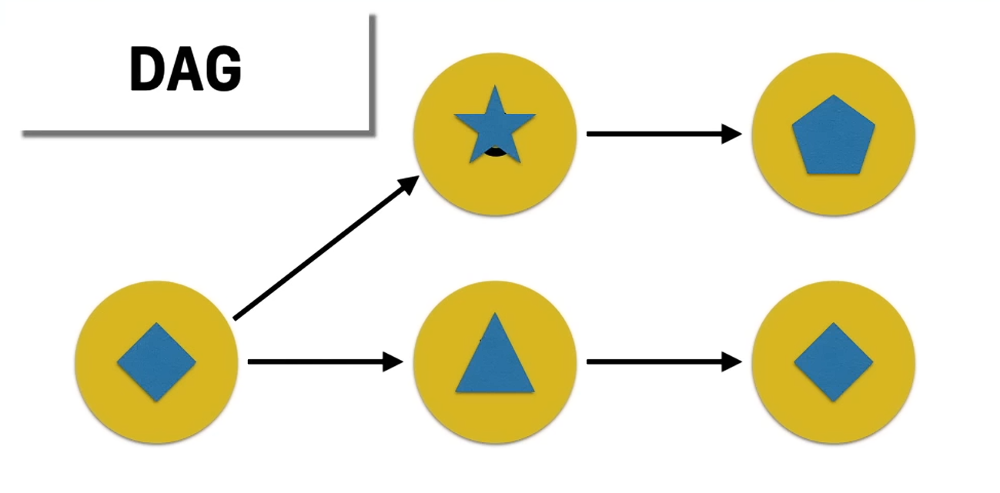
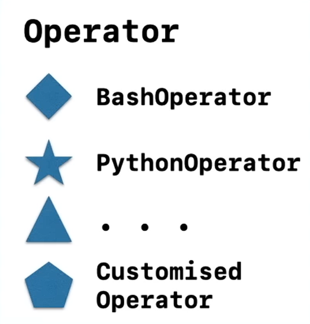
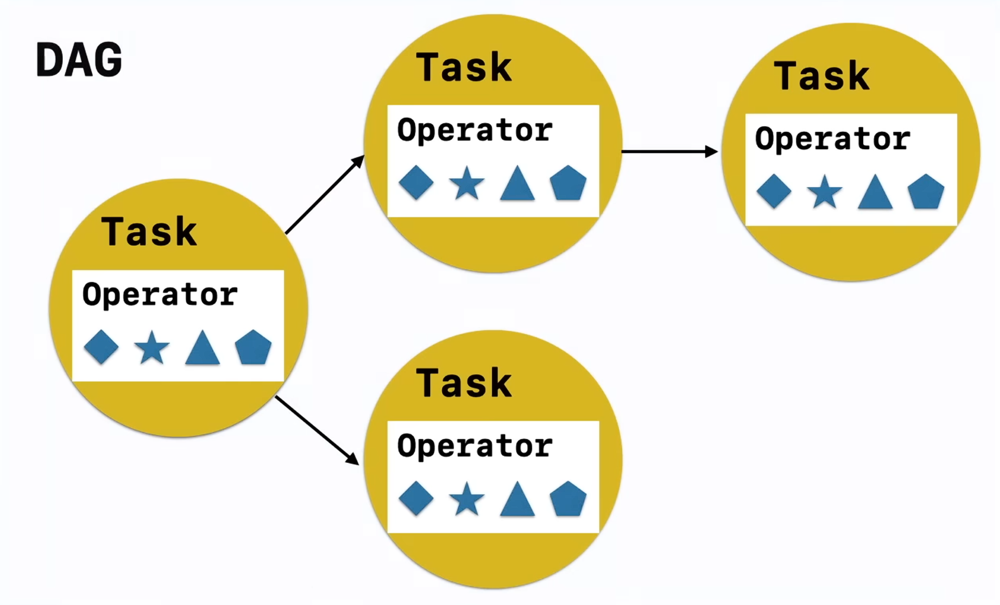
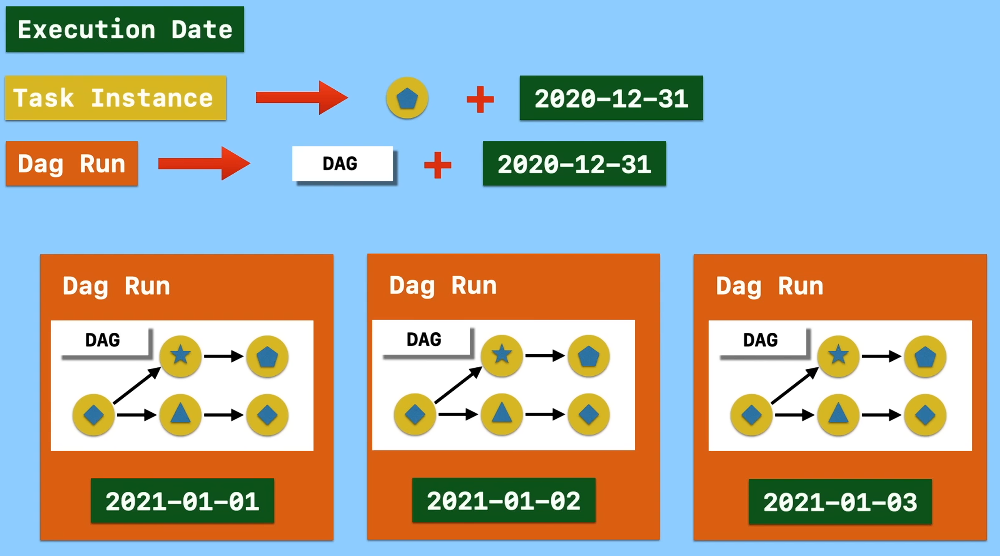
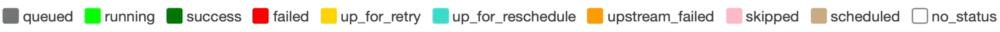
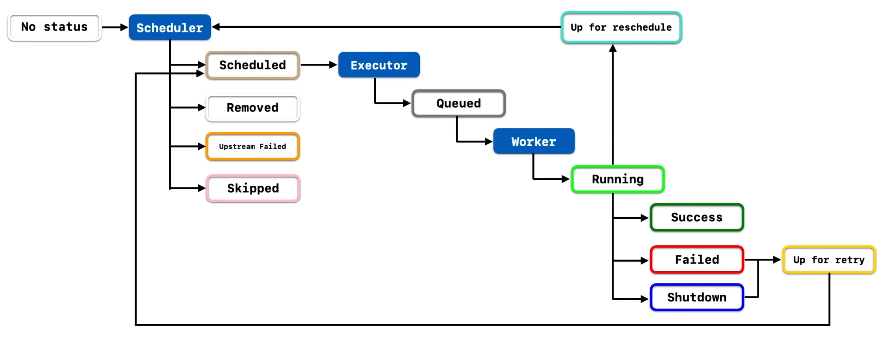
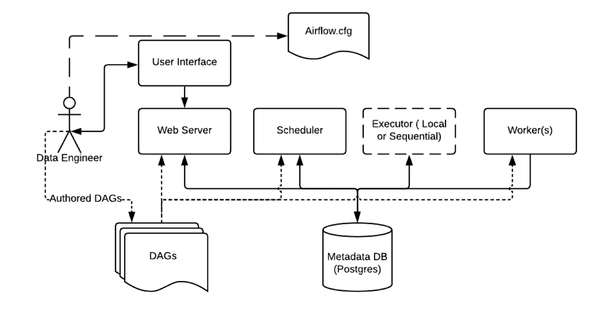
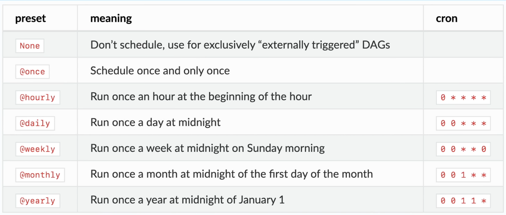
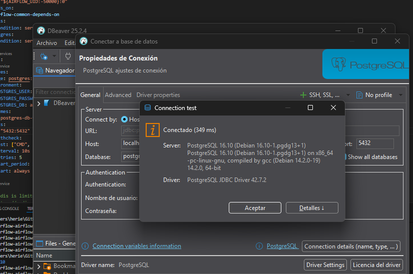

# DAGS, TASKS AND OPERATORS



A dag is a Directed Acyclic Graph, which is a collection of all the tasks you want to run, organized in a way that reflects their relationships and dependencies. In Airflow, a DAG is defined in a Python script that represents the workflow.


The operators are the building blocks of a DAG. They define a single task in the workflow. There are different types of operators for different types of tasks, such as BashOperator for running bash commands, PythonOperator for running Python functions, and many others.

The tasks are the instances of the operators. Each task represents a unit of work that needs to be executed. Tasks can have dependencies on other tasks, which means that one task cannot start until another task has completed.

So, a DAG is made up of multiple tasks, each defined by an operator, and the relationships between these tasks define the workflow.



# EXECUTION DATE, TASK INSTANCES AND SCHEDULE INTERVAL

The execution date represents the logical date and time for which a DAG run is scheduled. It is not the actual time when the task is executed, but rather a timestamp that indicates when the data being processed is relevant. For example, if a DAG is scheduled to run daily, the execution date for a run on January 2nd would be January 1st, as it processes data for that day.

A task instance is a specific run of a task within a DAG for a given execution date. Each time a DAG is triggered, either manually or according to its schedule, a new task instance is created for each task in the DAG. Task instances have their own state, which can be one of several values such as "success", "failed", "running", etc.

The schedule interval defines how often a DAG should be run. It can be set to various frequencies, such as daily, hourly, weekly, etc., or it can be defined using a cron expression for more complex scheduling. The schedule interval determines the execution dates for the DAG runs.



# TASK LIFECYCLE


A task goes through several states during its lifecycle:
- **Scheduled**: The task is scheduled to run at a specific time based on the DAG's schedule interval.
- **Queued**: The task is waiting in the queue to be picked up by a worker.
- **Running**: The task is currently being executed by a worker.
- **Success**: The task has completed successfully.
- **Failed**: The task has failed and will not be retried.
- **Up for retry**: The task has failed but is scheduled to be retried based on the retry policy defined in the DAG.
- **Up for reschedule**: The task is waiting to be rescheduled, typically used for tasks that are deferred.
- **Upstream failed**: The task cannot run because one of its upstream tasks has failed. The upstream is a task that must be completed before the current task can run.
- **Skipped**: The task was skipped, usually due to a condition defined in the DAG.
-  **No status**: The task has not been scheduled or run yet.
-  


# ARCHITECTURE



# DEPENDENCIES BETWEEN TASKS

Dependencies between tasks in Airflow are established using operators and setting relationships between them. This is typically done using the bitshift operators (`>>` and `<<`) or the `set_upstream()` and `set_downstream()` methods.

For example, consider two tasks, `task1`, `task2`, and `task3`. If you want `task2` and `task3` to run at the same time after `task1` has successfully completed, you can set the dependency like this:

```python
# Task dependency method 1
task1.set_downstream(task2)
task1.set_downstream(task3)

# Task dependency method 2
task1 >> task2
task1 >> task3

# Task dependency method 3 (for multiple tasks)
task1 >> [task2, task3]

```

This means that `task2` and `task3` will only start executing after `task1` has finished successfully. If `task1` fails, neither `task2` nor `task3` will run.


# Backfilling DAGs

Backfilling is the process of running a DAG for a specific range of past execution dates. This is useful when you want to reprocess data for a period that was missed or needs to be updated.

Steps to backfill a DAG from within the Airflow container:

1. Find the running Airflow container:
```bash
docker ps
# look for the container name (e.g. airflow-apiserver-1) or copy its container id
```

1. Open an interactive shell in the container (you can use the container name or id):
```bash
# using container name
docker exec -it airflow-apiserver-1 bash

# or using container id
docker exec -it <container_id> bash
```

3. Inside the container you should see the airflow user prompt (example):
```text
airflow@3b097f34a58c:/opt/airflow$
```

4. Run the backfill command for a date range:
```bash
airflow dags backfill create -s 2025-10-21 -e 2025-10-25 00_03_catchup_backfill_v02
```

Notes:
- Replace <container_id> with the actual id from docker ps, or use the container name.
- Adjust the start (`-s`) and end (`-e`) dates and the DAG id as needed.
- If you prefer not to enter an interactive shell, you can run the command directly with docker exec:
```bash
docker exec -it airflow-apiserver-1 airflow dags backfill create -s 2025-10-21 -e 2025-10-25 00_03_catchup_backfill_v02
```


# CRON EXPRESSIONS

A cron expression is a string that represents a schedule for running tasks in a more flexible way than standard intervals. It consists of five fields that specify the minute, hour, day of the month, month, and day of the week when the task should run.

We can visit the following website to help us create and understand cron expressions:
https://crontab.guru/




# FOR THE POSTGRES CONNECTION

We will download postgres, pgadmin, and DBeaver. THE PORTS ARE TOO IMPORTANT! I lasted 2 days trying to figure out why I could not connect to the database. You can only use one port per service, i had registered 5432 for the postgres test dvdrental, to change the ports the solution is this one: In the query tool

```
SHOW config_file;
SHOW data_directory;
SHOW port;
```
The output will show you the port that postgres is using, change it in the pg_hba.conf file and postgresql.conf file located in the data_directory path. 




Remember to restart the container after changing the ports. 

```
docker-compose up -d --no-deps --build postgres
```

And run it with 
```
docker-compose up -d
```

To restrt it completely
```
docker-compose down -v 
```
The -v flag removes the volumes too.
