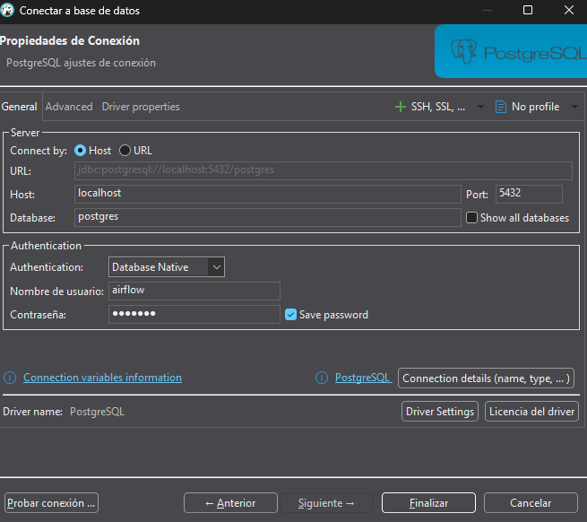
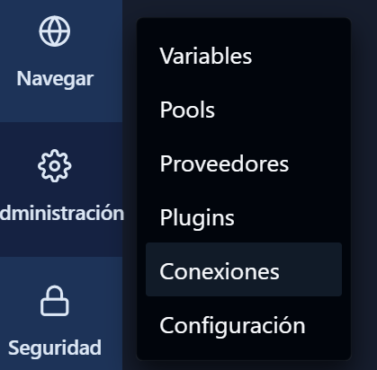
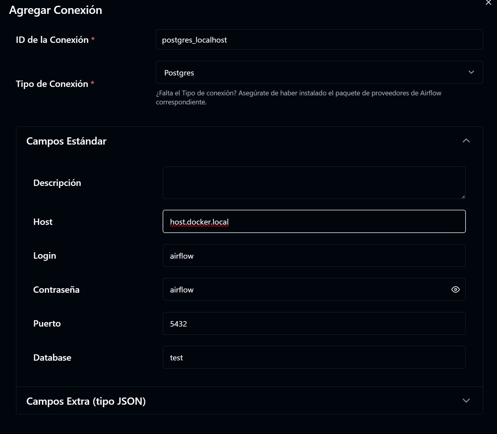
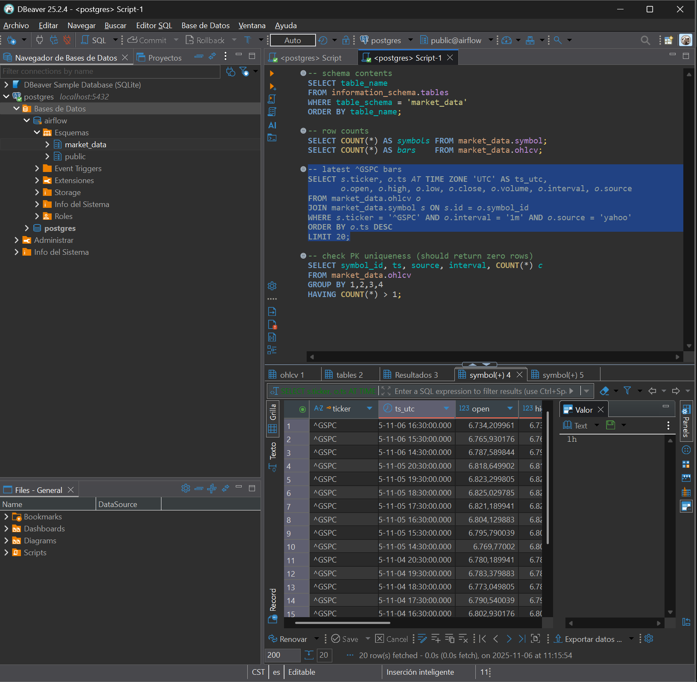

# Download docker-compose from its official GitHub repository:

https://airflow.apache.org/docs/apache-airflow/stable/howto/docker-compose/index.html

```
curl -O https://airflow.apache.org/docs/apache-airflow/3.1.1/docker-compose.yaml
```

to see your volumes:
```
docker volume ls
```

to remove all volumes:
```
docker volume rm $(docker volume ls -q)
```

to build the images:
```
docker compose up -d --build
```

`curl` is a command-line tool for transferring data with URLs. The `-O` option saves the file with its original name.

We also need to create the folders for Airflow to store its data. Run the following commands in your terminal:

```
mkdir -p ./config ./dags ./logs ./plugins
```
In this command, `mkdir -p` creates the specified directories and any necessary parent directories.
In `./config`, Airflow will store its configuration files.
In `./dags`, Airflow will store its Directed Acyclic Graphs (DAGs).
In `./logs`, Airflow will store its log files.
In `./plugins`, Airflow will store any custom plugins.

Then we need to create a `.env` file to set environment variables for Airflow. Create a file named `.env` in the same directory as the `docker-compose.yaml` file and add the following content:

```
AIRFLOW_UID=50000
```

This file contains several service definitions:
airflow-scheduler - The scheduler monitors all tasks and Dags, then triggers the task instances once their dependencies are complete.
airflow-dag-processor - The Dag processor parses Dag files.
airflow-api-server - The api server is available at http://localhost:8080.
airflow-worker - The worker that executes the tasks given by the scheduler.
airflow-triggerer - The triggerer runs an event loop for deferrable tasks.
airflow-init - The initialization service.
postgres - The database.
redis - The redis - broker that forwards messages from scheduler to worker.

# important:
We use docker compose up airflow init to initialize the database and create the admin user.
```
docker-compose up airflow init
```

This command initializes the Airflow database and creates the admin user with the credentials specified in the `docker-compose.yaml` file. By default, the username is `airflow` and the password is `airflow`. You can change these values in the `docker-compose.yaml` file if needed.

Then we can start all the services:
```
docker compose up -d
```

This command starts all the services defined in the `docker-compose.yaml` file in detached mode.


we are using everything!


To see the user and paasword 
```
docker compose config | Select-String _AIRFLOW_WWW_USER_
```

```
      _AIRFLOW_WWW_USER_CREATE: "true"
      _AIRFLOW_WWW_USER_PASSWORD: airflow
      _AIRFLOW_WWW_USER_USERNAME: airflow
```

# TO CONNECT FROM ANOTHER SITE
```
Get-NetIPConfiguration |
   Where-Object {$_.IPv4DefaultGateway} |
   ForEach-Object { $_.IPv4Address.IPAddress }
```
```
192.168.100.24
```
This means that to connect from another computer on the same network, you need to use the IP address of the machine running Airflow.
The 198 is referring to the local network range.
The 168 is referring to the subnet.
The 100 is referring to the specific host.
The 24 is the unique identifier for the machine on that host.

Then use http://192.168.100.24:8080


airflow# Connecting to Postgres Database

Ofc we need to have the Postgres service running.

We need to connect to the Postgres database running in the Docker container. We can use a database client like pgAdmin or DBeaver, or we can connect using the command line.

https://dbeaver.io/download/

in the terminal,

```
docker compose up -d --no-deps --build postgres
```
This command starts the Postgres service defined in the `docker-compose.yaml` file. The `-d` flag runs the container in detached mode, `--no-deps` prevents starting linked services, and `--build` builds the image before starting the container.

Remember that building an image means downloading the necessary files from the internet, so it may take some time depending on your internet speed. 

Given that we changed the docker-compose file, we need to rebuild the images for all services.

```docker compose up -d --build
```




Para la conexion nos vamos a conexion





# DOCKERFILE

We now can use python libraries! we created the `requirements.txt` and the `Dockerfile`, we also changed the `docker-compose.yaml` like this:

```yaml
  # image: ${AIRFLOW_IMAGE_NAME:-apache/airflow:3.1.1}
  image: ${AIRFLOW_IMAGE_NAME:-extending_airflow:3.1.1}
```

(Thats the tag we created, we gave it that name)

Since we modified the compose, we need to rebuild the image:

```
docker compose up -d --build
```

Every time we change the requirements, we need to rebuild the image:
```
docker build -t extending-airflow:3.1.1 .
```

```
docker compose down
docker build --no-cache -t extending-airflow:3.1.1 .
docker compose up -d --force-recreate --no-deps webserver scheduler
```

The requirements must be made by hand, not with pip freeze.
# FULL RESTART

```
docker compose down --remove-orphans
docker compose up -d postgres redis
docker compose ps   # wait until both are healthy
docker compose up -d airflow-init
docker compose logs -f airflow-init  # wait until it exits 0
docker compose up -d airflow-scheduler airflow-apiserver airflow-dag-processor airflow-triggerer airflow-worker
```


Cause now: Python in the containers is ignoring the user-site where you installed the provider. So the import fails even though you built it in.

Fastest fix, no rebuild:

1. Add the user-site to `PYTHONPATH` for all Airflow services.
   In your `docker-compose.yaml`, under `x-airflow-common.environment`, add:

```yaml
    PYTHONPATH: /home/airflow/.local/lib/python3.12/site-packages
```

2. As a quick safety net, also let the entrypoint install the provider at boot:

```yaml
    _PIP_ADDITIONAL_REQUIREMENTS: "apache-airflow-providers-postgres psycopg2-binary ${_PIP_ADDITIONAL_REQUIREMENTS:-}"
```

Keep this only while debugging. Remove later once the image is stable.

3. Restart in the right order (Windows PowerShell):

```powershell
docker compose down --remove-orphans
docker compose up -d postgres redis
docker compose ps   # wait until both are healthy
docker compose up -d airflow-init
docker compose logs -f airflow-init  # wait until it exits 0
docker compose up -d airflow-scheduler airflow-apiserver airflow-dag-processor airflow-triggerer airflow-worker
```

4. Verify imports from inside the container using PS-safe quoting:

```powershell
docker compose exec airflow-scheduler bash -lc "python -c \"import os,sys,site,importlib.util as u; print('py',sys.version); print('usersite',site.getusersitepackages()); print('PYTHONNOUSERSITE',os.environ.get('PYTHONNOUSERSITE')); print('PYTHONPATH',os.environ.get('PYTHONPATH')); print('prov', bool(u.find_spec('airflow.providers.postgres'))); print('op', bool(u.find_spec('airflow.providers.postgres.operators.postgres')));\""
```

Expected: `prov True`, `op True`.

5. If still False, confirm the provider is present:

```powershell
docker compose exec airflow-scheduler bash -lc "pip show apache-airflow-providers-postgres && python -c \"import pkgutil; import sys; print('providers', [m.name for m in pkgutil.iter_modules() if m.name.startswith('airflow.providers.postgres')]);\""
```

Optional clean image fix (if you prefer no `_PIP_ADDITIONAL_REQUIREMENTS`):

* In your Dockerfile, after installing with `--user`, add:

```dockerfile
ENV PYTHONPATH=/home/airflow/.local/lib/python3.12/site-packages
```

* Rebuild and recreate services as you did.

Once `PYTHONPATH` includes the user-site, this line will work at parse time:

```python
from airflow.providers.postgres.operators.postgres import PostgresOperator
```


# Ver desde SQL 


