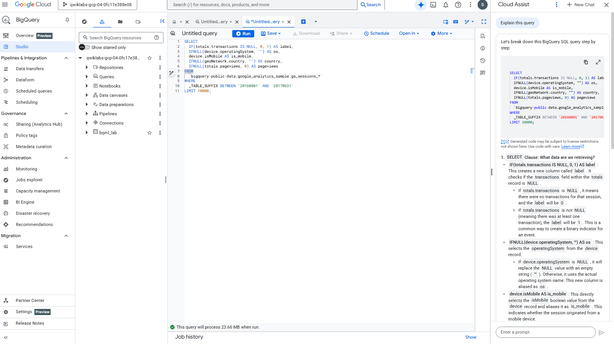
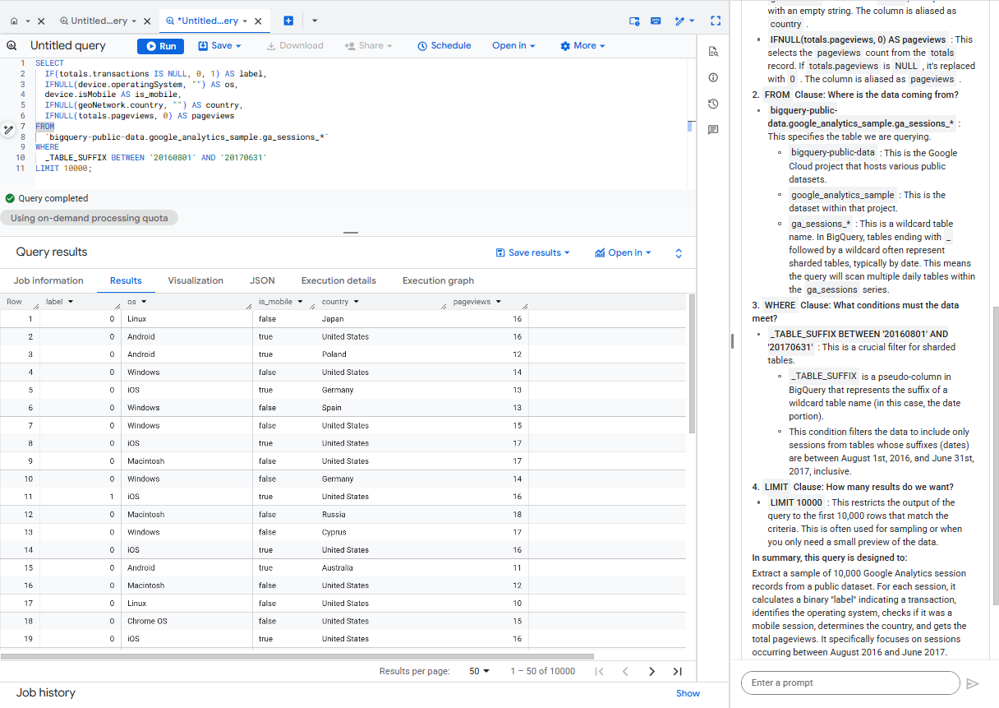
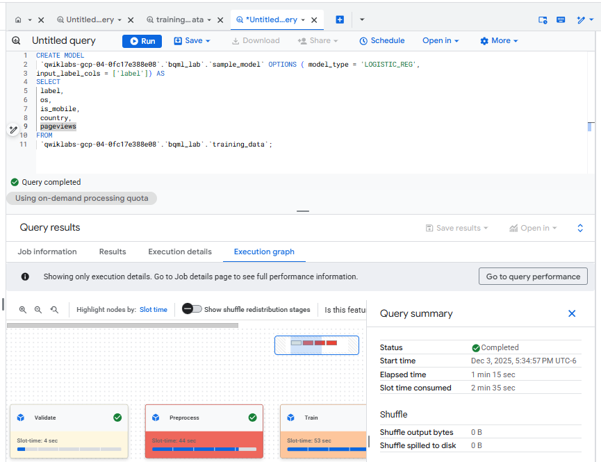
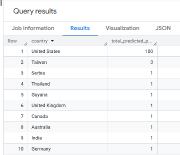
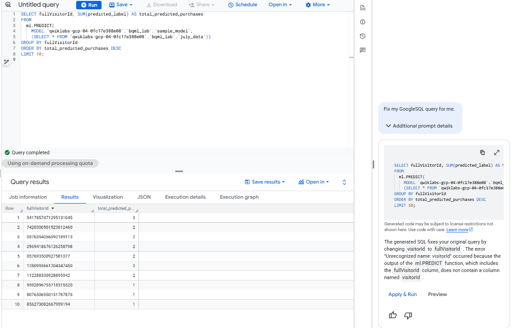

# Explore the Data

```
SELECT
  IF(totals.transactions IS NULL, 0, 1) AS label,
  IFNULL(device.operatingSystem, "") AS os,
  device.isMobile AS is_mobile,
  IFNULL(geoNetwork.country, "") AS country,
  IFNULL(totals.pageviews, 0) AS pageviews
FROM
  `bigquery-public-data.google_analytics_sample.ga_sessions_*`
WHERE
  _TABLE_SUFFIX BETWEEN '20160801' AND '20170631'
LIMIT 10000;
```

This GoogleSQL query is designed to extract a sample of Google Analytics session data and transform it into a format suitable for machine learning or analytical purposes.







# Create the Model

Create a model name sample_model, type logistic_reg to predict whether a visitor will make a transaction using the training_data view table.


```
CREATE MODEL
 `qwiklabs-gcp-04-0fc17e388e08`.`bqml_lab`.`sample_model` OPTIONS ( model_type = 'LOGISTIC_REG',
input_label_cols = ['label']) AS
SELECT
 label,
 os,
 is_mobile,
 country,
 pageviews
FROM
 `qwiklabs-gcp-04-0fc17e388e08`.`bqml_lab`.`training_data`;
 ```


# Evaluate the Model


Write a query to evaluate the performance of the model `bqml_lab.sample_model` using the `ml.EVALUATE` function.

```
SELECT
*
FROM
ML.EVALUATE( MODEL `qwiklabs-gcp-04-0fc17e388e08`.`bqml_lab`.`sample_model`,
TABLE `qwiklabs-gcp-04-0fc17e388e08`.`bqml_lab`.`training_data`);
```


# Predict with the Model

```
SELECT
  IF(totals.transactions IS NULL, 0, 1) AS label,
  IFNULL(device.operatingSystem, "") AS os,
  device.isMobile AS is_mobile,
  IFNULL(geoNetwork.country, "") AS country,
  IFNULL(totals.pageviews, 0) AS pageviews,
  fullVisitorId
FROM
  `bigquery-public-data.google_analytics_sample.ga_sessions_*`
WHERE
  _TABLE_SUFFIX BETWEEN '20170701' AND '20170801';
```

You'll realize the SELECT and FROM portions of the query is similar to that used to generate training data. There is the additional fullVisitorId column which you will use for predicting transactions by individual user.The WHERE portion reflects the change in time frame (July 1 to August 1 2017).

With this query you will try to predict the number of transactions made by visitors of each country or region, sort the results, and select the top 10 by purchases:

```
SELECT
  country,
  TOTAL(predicted_label) as total_predicted_purchases
FROM
  ml.PREDICT(MODEL `bqml_lab.sample_model`, (
SELECT * FROM `bqml_lab.july_data`))
GROUP BY country
ORDER BY total_predicted_purchases DESC
LIMIT 10;
```

It had an error because the table `bqml_lab.july_data` does not exist. You need to create the table first using the first query provided above to extract the July data.

```
SELECT country, SUM(predicted_label) AS total_predicted_purchases
FROM
  ml.PREDICT(
    MODEL `qwiklabs-gcp-04-0fc17e388e08.bqml_lab.sample_model`,
    (SELECT * FROM `qwiklabs-gcp-04-0fc17e388e08`.`bqml_lab`.`july_data`))
GROUP BY country
ORDER BY total_predicted_purchases DESC
LIMIT 10;
```





