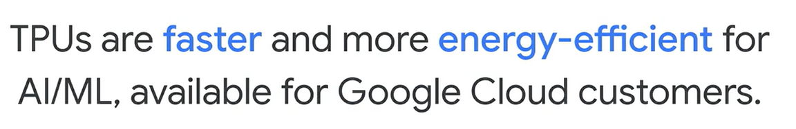
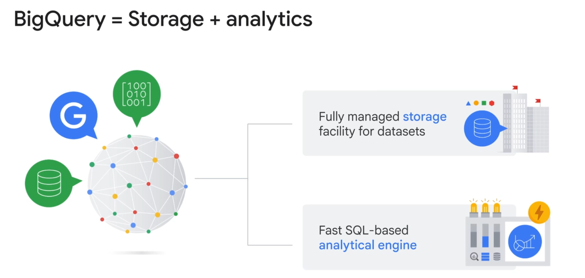
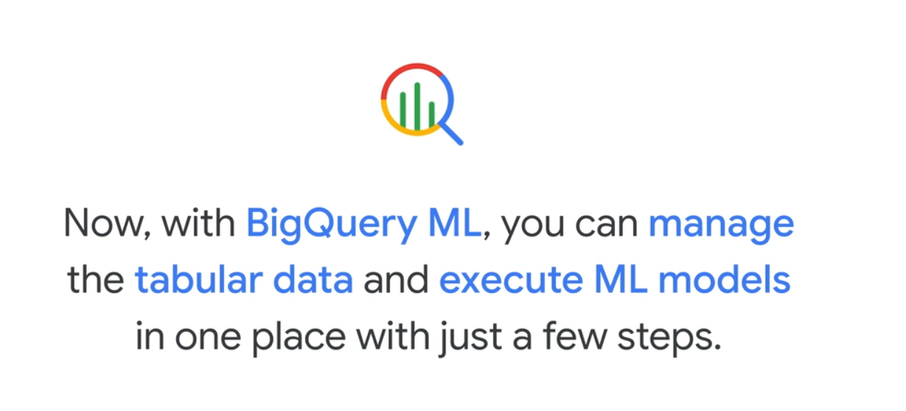
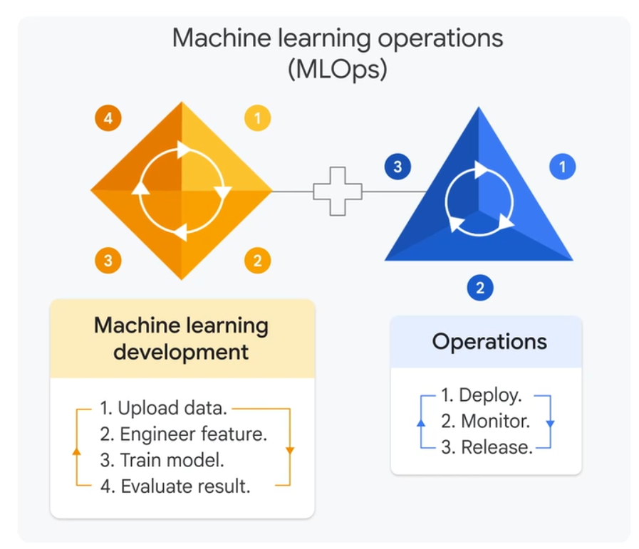
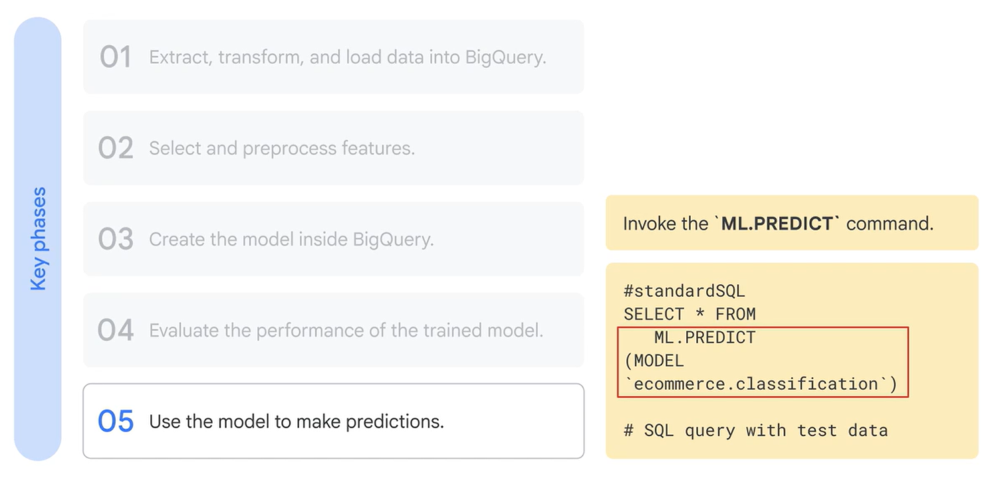

TPU is an AI accelerator application-specific integrated circuit (ASIC) developed by Google specifically for neural network machine learning. Google Cloud offers access to TPUs for high-performance AI workloads.

When considering data storage and processing options on Google Cloud, it's essential to evaluate the nature of your data and your specific use cases:

 if your data is structured, organized in tables, rows, and columns, you have options like BigQuery, AlloyDB for PostgreSQL, and others. Note that BigQuery, Google's flagship data warehouse is particularly versatile. It's built for structured data and also highly optimized for semi-structured data like JSON. It can even query unstructured data, such as log files or images stored in cloud storage by creating an external table that provides a structured reference to that data.

 

  train predictive models for forecasting or leverage GenAI for content creation and action. Vertex AI is the central AI development platform offering products like Vertex AI Studio, Agent Builder, Auto ML, and Notebooks for AI projects ranging from out-of-the-box solutions to custom builds. These tools are seamlessly integrated on Google Cloud, enabling data scientists and AI developers to efficiently transition from data to AI. For example, BigQuery offers embedded SQL commands to train an ML model, a feature you'll explore later. Additionally, within a Vertex AI Notebook, you can easily pull data directly from BigQuery using SQL for advanced model training.

# Big Query ML

BigQuery ML allows users to create and execute machine learning models directly within BigQuery using SQL queries. This integration simplifies the process of building and deploying ML models by leveraging existing data in BigQuery without the need for extensive data movement or complex coding.

